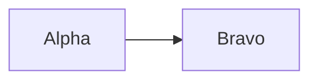

# Reload

reload.spec.mjs rewrites this file while a diagram is expanded, and puts it back after
each test.

```mermaid
flowchart LR
  A[Alpha] --> B[Bravo]
```

```mermaid
flowchart LR
  C[Charlie] --> D[Delta]
```
