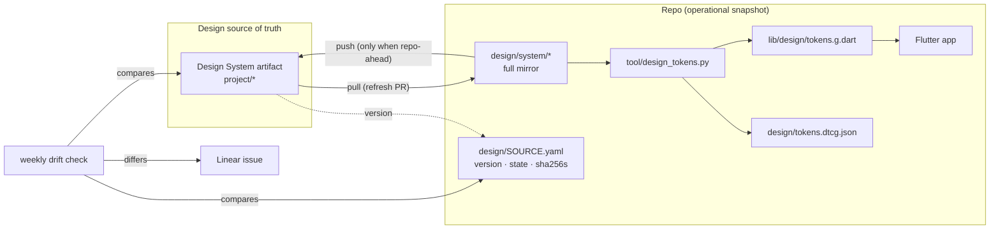
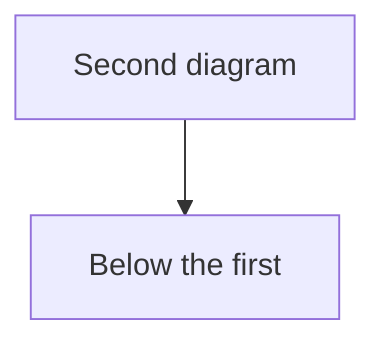

# Wide diagram

A left-to-right flowchart with subgraphs, wide enough that the article column has to
shrink it.

```mermaid
flowchart LR
  subgraph design["Design source of truth"]
    A["Design System artifact<br/>project/*"]
  end
  subgraph repo["Repo (operational snapshot)"]
    B["design/system/*<br/>full mirror"] --> C["tool/design_tokens.py"]
    C --> D["lib/design/tokens.g.dart"] --> E["Flutter app"]
    C --> F["design/tokens.dtcg.json"]
    G["design/SOURCE.yaml<br/>version · state · sha256s"]
  end
  H["weekly drift check"] -- compares --> A
  H -- compares --> G
  H -- differs --> I["Linear issue"]
  A -- "pull (refresh PR)" --> B
  B -- "push (only when repo-ahead)" --> A
  A -. version .-> G
```

```mermaid
flowchart TD
  X[Second diagram] --> Y[Below the first]
```
